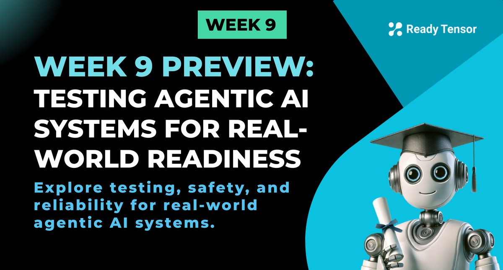

---

--DIVIDER--

# TLDR

This week focuses on production testing for agentic AI systems. You'll learn to automate quality checks, prevent regressions, and ensure safety and reliability in real-world deployments.

---

--DIVIDER--

 

 
<strong>Welcome to Week 9 of the Agentic AI Developer Certification Program!</strong

 
 
 Congratulations — you’ve made it to **Module 3: Real-World Readiness**.
 
 Until now, you’ve focused on what your agentic systems can do: retrieve information, coordinate roles, use tools, and reason through complex tasks. You’ve built some powerful prototypes.
 
 But building for **production** is a different game.
 
 This module is about moving from “It works in my notebook” to **“It works every time — even in the real world.”**
 
 ---

--DIVIDER--

# What changes in production?

In a real-world setting, you won’t be manually testing your pipeline before every change. You’ll ship new prompts, swap tools, retrain components — and still need **confidence** that your system behaves correctly, safely, and consistently.

> That’s what production testing is about:
> **Automated. Repeatable. Trustworthy.**

It’s not just about _catching bugs_ — it’s about preventing **regressions**, protecting against unsafe behavior, and setting a high bar for quality every time your system evolves.

---

--DIVIDER--

# What’s in store this week?

This week is about designing systems that **don’t safe, secure, and reliable.**

- **Lessons 1a–1d**: Write unit, integration, and performance tests using `pytest` to validate your full pipeline, not just one-off prompts.
- **Lesson 2**: Test for safety, ethics, and alignment - because “working” isn’t the same as “responsible.”
- **Lessons 3–4**: Add guardrails, validate structured outputs, and scan for bias or failure risks using Guardrails and Giskard.
- **Lesson 5**: Explore red teaming: the practice of deliberately stress-testing your system to reveal blind spots.

By the end of this week, you’ll be able to:

- Automate quality checks for any agent workflow
- Prevent regressions and silent failures
- Catch unsafe, biased, or brittle behavior before users do

Your project is no longer just a demo.
It’s a practical, real-world application. And this is how you make it production-ready.

---
