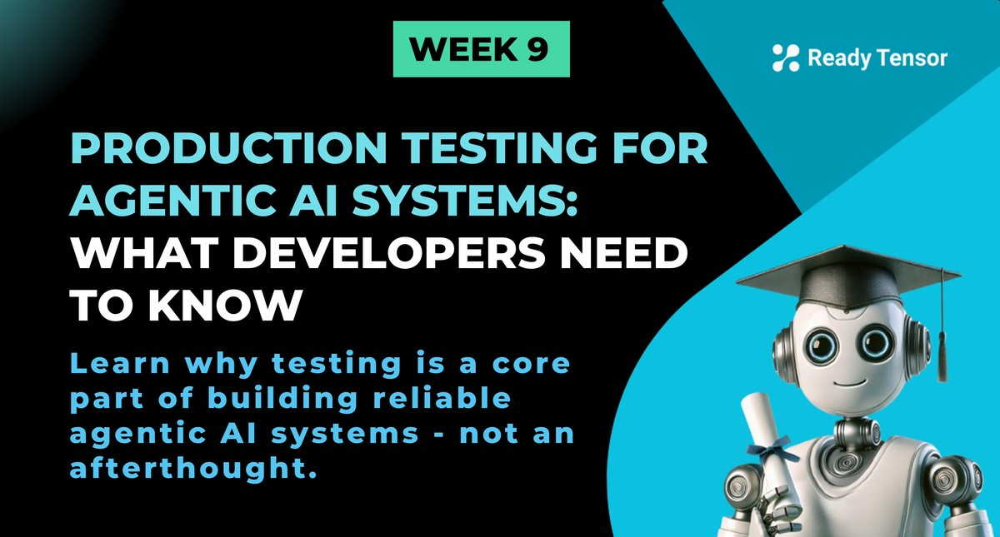

--DIVIDER--

---

[🏠 Home - All Lessons](https://app.readytensor.ai/hubs/ready_tensor_certifications)

[⬅️ Previous - Week 9 Preview](https://app.readytensor.ai/publications/h4GLp8hyNZDt)
[➡️ Next - Getting started with pytest](https://app.readytensor.ai/publications/cpoAQfEZCcmi)

---

--DIVIDER--

# TL;DR

This lesson introduces production testing for agentic AI systems — the kind that combine LLMs with traditional software components. You'll learn why testing isn’t just a nice-to-have, but a core part of building reliable, real-world applications, and you’ll get familiar with the four key types of tests: unit, integration, system, and performance.

---

--DIVIDER--

# From Notebook to Production

What’s the difference between a good demo project and a production-grade system?

What’s the difference between the work of a junior AI developer and someone with real production experience?

It’s not just model accuracy.  
 It’s not just a slick Streamlit app.

It's a shift in mindset — from "Does it work for me?" to "Will it keep working when things change?"

And one of the clearest signals of that mindset? **Testing**.

You can often tell what kind of developer built a system just by scanning the repo:

- Are there any tests at all?
- Is the code modular enough to test individual parts in isolation?
- Do the tests go beyond the happy path — covering edge cases, weird inputs, and failure modes?
- Is there logging, error-handling, and some anticipation of what could go wrong?

Junior developers often build systems that work — as long as everything goes right.  
 Experienced developers build systems that work even when something goes wrong.  
 That’s the difference. And it shows.

---

--DIVIDER--

# Why Junior Projects Fail in Production

Let’s be honest. Most first attempts at AI systems (or software projects in general) are built for the happy path:

- The user inputs what we expect.
- The API returns what it should.
- The LLM behaves like it did in our test prompt.
- No one tries to manipulate it.
- Nothing times out.
- Everything behaves as expected.

But here’s what actually happens in production:

- A user asks something that breaks the prompt structure.
- A tool returns invalid output.
- A document triggers an unexpected parsing error.
- Someone refreshes the page and sends the same request five times.
- Your model provider silently updates the underlying model and now your responses are in a different format.

And suddenly: your once-reliable system collapses in unexpected ways.

Having something “work on your laptop” is not the same as **trusting it in production**. That’s why we test.

---

--DIVIDER--

# Testing Might Sound Boring… Until It Saves You

Let’s also acknowledge something else.

Testing doesn’t always _sound_ exciting. It’s not as glamorous as chaining prompts or building clever tool-using agents.  
 It might even feel like someone else’s job - a task to be handled by a separate QA team, or pushed off until the end.

That used to be the norm in software teams.  
 But that mindset is changing - fast.

Modern engineering teams now expect developers to write their own tests. Why? Because the people building the system are the ones who understand its edge cases best.

And the best developers? They **design with testing in mind**. That approach has a name - **Test-Driven Development** - and it consistently leads to more reliable, maintainable systems.

So don’t treat testing like a chore. Treat it like part of the craft. It's an important mindset shift that will make you a better developer.

---

--DIVIDER--

:::info{title="Info"}

 <h2> What is Test-Driven Development (TDD)?</h2>
 
 Test-Driven Development is a software development methodology where you write tests before writing the actual code. The TDD cycle follows three simple steps:
 
 1. **Red**: Write a failing test first
 2. **Green**: Write the minimum code to make the test pass
 3. **Refactor**: Improve the code while keeping tests passing
 
 Most experienced developers swear by TDD because it forces you to think about your code's behaviour before implementation. This leads to better design, clearer requirements, and more maintainable code. When you write tests first, you're essentially defining a contract for how your code should behave. 
 
 TDD also prevents over-engineering. Since you only write code to make tests pass, you avoid adding unnecessary features or complexity that might introduce bugs later.
 
 :::
 
---

--DIVIDER--

# This Week: What We’ll Focus On

The next few lessons are about building the testing muscle you’ll need to take your agentic system seriously.

Not just testing the LLM’s accuracy (what we call evaluation), but testing your **actual software**:

- Agent nodes
- Tool wrappers
- Agentic workflows
- Response formatting
- File I/O
- System behavior under stress

In other words: all the stuff that breaks when you least expect it.

---

--DIVIDER--

# Types of Tests We’ll Use

Let’s walk through the core categories of testing you’ll be using throughout the rest of this week. Each one answers a different question and catches a different kind of failure.

--DIVIDER--

## Unit Tests: Does this one thing work?

These are the smallest tests in your system. You’re checking individual functions, prompt templates, validators, or tool wrappers.

For example:

- Does your title generator agent node return a title of the right length?
- Does your output parser catch malformed JSON?
- Does your function to retrieve documents from a vector store return results in the expected format?

Unit tests are easy to run, fast to write, and give you confidence that the building blocks of your system behave as expected.

--DIVIDER--

## Integration Tests: Do the parts work together?

Sometimes each component works fine… until you connect them.

Integration tests verify that your chain of steps — like prompt → tool → format → output — actually works when real data flows through it.

For example:

- Does your question-answering pipeline return a usable answer when you plug in real documents?
- Does your LangGraph system handle retries correctly when one node fails?
- Does the tool output match what the downstream prompt expects?

You’ll write integration tests to simulate realistic system behavior and catch breakdowns in coordination between parts.

--DIVIDER--

## System (End-to-End) Tests: Does the full system behave as expected?

End-to-end tests check that your entire application — from input to final output — behaves correctly under real-world conditions.

These tests simulate **the full user experience** — from input to output, across tools, prompts, and memory.

For example:

- In your RAG-based chatbot, can a user ask multi-turn questions and get coherent answers based on the right documents?
- In your agentic authoring assistant, does the reference generation step return links that are relevant and properly formatted?
- If a user restarts a session or changes topics, does your memory or session logic handle it cleanly?

System tests simulate actual usage scenarios — not just to verify correctness, but to build confidence that your AI app behaves reliably from start to finish.

--DIVIDER--

## Performance Tests: Does it behave well under load?

Performance tests check how your system behaves under stress. They help you understand:

- How long does a typical request take?
- How much CPU and GPU memory does it use?
- What happens if you send 10 requests in quick succession?
- Do timeouts and retries work?
- Can the system recover from an unexpected tool failure?

These tests are especially important if you’re deploying to a platform like Hugging Face Spaces or Render, where cold starts, resource limits, and timeouts can cause hard-to-debug behavior.

---

--DIVIDER--

# Coming Up Next

In the next lesson, we’ll jump into `pytest`, the testing framework we’ll use throughout the week.

We’ll show you how to:

- Write clean, Pythonic tests for both traditional functions and LLM-based workflows
- Use fixtures and mocks to isolate testable pieces
- Keep your system testable even as it grows

Let’s get into it.

--DIVIDER--

---

[🏠 Home - All Lessons](https://app.readytensor.ai/hubs/ready_tensor_certifications)

[⬅️ Previous - Week 9 Preview](https://app.readytensor.ai/publications/h4GLp8hyNZDt)
[➡️ Next - Getting started with pytest](https://app.readytensor.ai/publications/cpoAQfEZCcmi)

---
