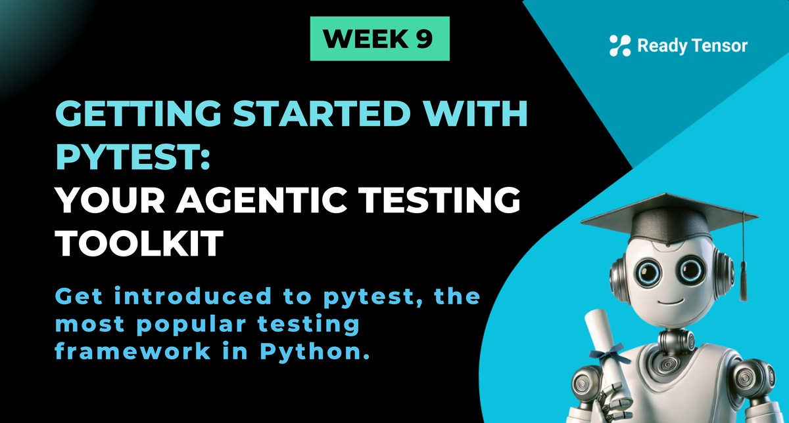

--DIVIDER--

# TL;DR

In this lesson, you’ll get hands-on with Pytest, the testing framework we’ll use throughout the rest of the module. You’ll learn how to install it, write simple tests with assert, use fixtures for reusable setup, share config with conftest.py, and run the same test with multiple inputs using parameterization. These building blocks will prepare you to start testing real agentic components in the next lessons.

---

--DIVIDER--

# Why pytest for Agentic AI?

If you’ve ever written a Python script and thought, “I hope this keeps working,” you’re already halfway to understanding why pytest exists.

At its core, pytest is a testing framework — but not the clunky, old-school kind that makes you write classes and boilerplate before you can even check if `2 + 2 == 4`. pytest takes the opposite approach: write a regular function, use a plain old `assert`, and you’re done. That’s it. You’ve written a test.

This simplicity is exactly why we’re using it.

Now — yes, Python does come with a built-in testing library called `unittest`. And to its credit, it works. If you're already using it in your projects, there’s no need to abandon it. But compared to pytest, `unittest` tends to be more verbose, less readable, and a bit clunkier to scale. With pytest, you get clean syntax, better tooling, and far less friction — at the cost of installing one extra package. For most developers (including us), that tradeoff is more than worth it.

As our agentic systems grow — with agent nodes, tools, retrievers, formatters, fallback logic — so do the number of places things can break. We need a testing framework that doesn’t get in our way. One that’s flexible enough to test a LangGraph node, a prompt validator, or a memory manager — and one that grows with us as our workflows evolve.

pytest fits that bill perfectly.

It’s fast to get started with, but deceptively powerful. Once you get the hang of the basics, you’ll find features like fixtures (for reusable setup), `conftest.py` (for shared test utilities), and parameterized testing (for checking multiple cases at once) that will make your life way easier — especially once we dive into testing your actual agent code in the next few lessons.

So no, pytest isn’t some special “AI testing framework.” It’s a general-purpose Python tool. But it’s the one we’ll rely on for everything from small sanity checks to full-system confidence tests.

Let’s get you up to speed.

---

--DIVIDER--

# Installing pytest

Before we start writing tests, we need to install the tool that runs them.

`pytest` isn’t built into Python — it’s a third-party library. But installing it is just one line:

```bash
pip install pytest
```

That’s it. You’re ready to write and run tests.

But let’s take it one step further. Instead of installing it manually every time, we recommend creating a `requirements-test.txt` file — a simple list of packages needed for testing.

```txt
# requirements-test.txt
pytest>=8.4
```

Then you (or your teammate or your CI pipeline) can install everything with:

````bash
pip install -r requirements-test.txt
```

--DIVIDER--

:::tip{title="Tip"}

In this program, we’re keeping **test dependencies separate** from runtime dependencies. Why?

Because production systems don’t need your test tools — and sometimes they’re running in lightweight containers where every extra package matters.
By using a dedicated `requirements-test.txt`, you make it crystal clear what’s only needed during development and testing.

:::

--DIVIDER--

You’ll add more tools to this file as we go — like `pytest-cov` for coverage reports and other utilities for mocking or profiling.

To confirm everything’s working, just run:

```bash
pytest --version
````

If it prints something like `pytest 8.x.x`, you’re all set.

Next up: your first test.

---

--DIVIDER--

# Writing and Running Tests

In this lesson, we are going to learn how to test traditional software, software that consistently produces the same output for the same input. In the next few lessons, we’ll explore how to test AI-based software, which behaves differently.

--DIVIDER--

## Writing Simple Test Functions

Let’s start with something familiar: a basic calculator.

We’ve got a Python module called `calculator.py` with three simple functions — `add`, `multiply`, and `divide`. Here’s the code:

```python
# calculator.py

def add(a, b):
    """Add two numbers and return the result."""
    return a + b

def multiply(a, b):
    """Multiply two numbers and return the result."""
    return a * b

def divide(a, b):
    """Divide two numbers and return the result."""
    return a / b
```

Now create a test file called `test_calculator.py`:

```python
# test_calculator.py

import pytest
from calculator import add, multiply, divide

def test_add_positive_numbers():
    result = add(2, 3)
    assert result == 5

def test_add_negative_numbers():
    result = add(-1, -1)
    assert result == -2

def test_multiply_basic():
    result = multiply(4, 3)
    assert result == 12

def test_divide_basic():
    result = divide(10, 2)
    assert result == 5.0

def test_divide_by_zero():
    with pytest.raises(ValueError, match="Cannot divide by zero"):
        divide(10, 0)
```

A few things to notice here:

- Each test function starts with `test_` — that’s how `pytest` knows to run it.
- We use plain `assert` statements to check results.
- When we expect an error (like dividing by zero), we use `pytest.raises` to confirm the exception is raised — and that the message matches what we expect.

These tests are short, readable, and directly express what we want to verify. No classes. No setup boilerplate. Just clean, direct checks that give us confidence the code behaves as expected.

Next up: how to actually run these tests and interpret the results.

---

--DIVIDER--

## Running Your Tests

Once you’ve written a few test functions, it’s time to run them.

To run all tests in your project, just type:

```bash
pytest
```

This will search the current directory (and subdirectories) for any files that match `test_*.py` or `*_test.py`, and run every function that starts with `test_`.

You can also run a specific test file:

```bash
pytest path/to/test_calculator.py
```

Or even a specific test function within that file:

```bash
pytest path/to/test_calculator.py::test_add_positive_numbers
```

Now, let's see what happens when we run our tests.

---

--DIVIDER--

## Test Reporting

After you run your tests, `pytest` gives you a clean summary of what happened — which tests passed, which failed, and how long everything took.

Here’s what a typical report might look like:

```bash
===================================== test session starts =========================================
...
collected 5 items

tests\test_calculate.py .....                                                               [100%]

====================================== 5 passed in 0.03s ==========================================
```

Let’s break it down:

- `collected 5 items`: pytest found five tests across your files.
- The dots and letters (`..F...`) show the order of test results — each dot means a test passed. If a test had failed, you would see an `F` instead.
- The short summary section tells you which test failed and why. Since we only have passing tests in this case, it’s all good news!
- And the final line gives you a quick snapshot: how many passed, how many failed, and how long the test run took.

---

--DIVIDER--

## Testing a Class with pytest

Let's create a more complex example with a class:

````python
# bank_account.py
class BankAccount:
    def __init__(self, initial_balance=0):
        if initial_balance < 0:
            raise ValueError("Initial balance cannot be negative")
        self._balance = initial_balance

    @property
    def balance(self):
        return self._balance

    def deposit(self, amount):
        if amount <= 0:
            raise ValueError("Deposit amount must be positive")
        self._balance += amount
        return self._balance

    def withdraw(self, amount):
        if amount <= 0:
            raise ValueError("Withdrawal amount must be positive")
        if amount > self._balance:
            raise ValueError("Insufficient funds")
        self._balance -= amount
        return self._balance

    def transfer(self, amount, target_account):
        if not isinstance(target_account, BankAccount):
            raise TypeError("Target must be a BankAccount instance")
        self.withdraw(amount)
        target_account.deposit(amount)
```

--DIVIDER--

And its corresponding test file:

```python
# test_bank_account.py
import pytest
from bank_account import BankAccount

class TestBankAccount:

    def test_initial_balance_default(self):
        """Test account creation with default balance."""
        account = BankAccount()
        assert account.balance == 0

    def test_initial_balance_custom(self):
        """Test account creation with custom balance."""
        account = BankAccount(100)
        assert account.balance == 100

    def test_initial_balance_negative(self):
        """Test that negative initial balance raises error."""
        with pytest.raises(ValueError, match="Initial balance cannot be negative"):
            BankAccount(-50)

    def test_deposit_positive_amount(self):
        """Test depositing positive amount."""
        account = BankAccount(100)
        new_balance = account.deposit(50)
        assert new_balance == 150
        assert account.balance == 150

    def test_deposit_zero_amount(self):
        """Test that depositing zero raises error."""
        account = BankAccount(100)
        with pytest.raises(ValueError, match="Deposit amount must be positive"):
            account.deposit(0)

    def test_withdraw_valid_amount(self):
        """Test withdrawing valid amount."""
        account = BankAccount(100)
        new_balance = account.withdraw(30)
        assert new_balance == 70
        assert account.balance == 70

    def test_withdraw_insufficient_funds(self):
        """Test that withdrawing more than balance raises error."""
        account = BankAccount(50)
        with pytest.raises(ValueError, match="Insufficient funds"):
            account.withdraw(100)

    def test_transfer_between_accounts(self):
        """Test transferring money between accounts."""
        account1 = BankAccount(100)
        account2 = BankAccount(50)

        account1.transfer(30, account2)

        assert account1.balance == 70
        assert account2.balance == 80

    def test_transfer_invalid_target(self):
        """Test that transferring to invalid target raises error."""
        account = BankAccount(100)
        with pytest.raises(TypeError, match="Target must be a BankAccount instance"):
            account.transfer(50, "not_an_account")
```

--DIVIDER--

Now, you should see an output like this when you run the tests:

```bash

====================================== test session starts =======================================
collected 14 items

tests\test_bank_account.py .........                                                        [ 64%]
tests\test_calculate.py .....                                                               [100%]

====================================== 14 passed in 0.05s =========================================
````

---

--DIVIDER--

## Test Discovery and Naming Conventions

One of the best parts about using `pytest` is that it just works — no need to manually register tests or build complex test suites. As long as you follow a few simple naming rules, `pytest` will automatically discover and run your tests.

Here’s what you need to know:

- **Test files** should start with `test_` or end with `_test.py`.
  Example: `test_calculator.py` ✅

- **Test functions** should start with `test_`.
  Example: `def test_add_positive_numbers():` ✅

- **Test classes** should start with `Test` and should not have an `__init__` method.
  Example: `class TestBankAccount:` ✅

When you run `pytest`, it recursively searches your project directory for files that match these patterns and collects all test functions and methods that follow the conventions.

Following these patterns keeps your test suite organized, consistent, and automatically executable — no extra boilerplate or configuration required.

If `pytest` isn't finding your tests, check your file and function names first — it’s usually that.

---

--DIVIDER--

## Organizing Your Tests

There’s no single “correct” way to structure your tests — it depends on the size of your project, your team’s habits, and your tooling. But consistency matters, and a thoughtful layout makes your life easier as the project grows.

In this program, we’ll follow a simple pattern: **mirror your code structure inside a separate `tests/` directory**.

Here’s what that looks like:

```txt
my_project/
├── code/
│   ├── data_processing/
│   │   └── loader.py
│   └── agents/
│       └── tagger.py
└── tests/
    ├── data_processing/
    │   └── test_loader.py
    └── agents/
        └── test_tagger.py
```

A few quick notes:

- Each test module lives in a directory that mirrors the one in `code/`
- Test files are named after the module they’re testing, prefixed with `test_`
- This structure works well with `pytest`'s discovery system — and keeps your tests easy to find and maintain

You can also add utility files like `conftest.py` (we’ll cover that soon) inside `tests/` or any of its subfolders to share fixtures or configuration between tests.

Keeping your tests separate from your main code — but organized the same way — gives you the best of both worlds: clarity, discoverability, and clean separation between production and test logic.

---

--DIVIDER--

# Advanced pytest Features

pytest has a lot more to offer once you’re comfortable with the basics. Here are a few features that will come in handy as your tests get more complex.

Want to go deeper? Check out the [official pytest docs](https://docs.pytest.org/en/stable/contents.html).

--DIVIDER--

## Fixtures for Test Setup

Fixtures help you set up and reuse data or state across multiple tests. Instead of repeating the same setup code in every test, you define it once and inject it where needed.

```python
import pytest
from bank_account import BankAccount

@pytest.fixture
def sample_account():
    return BankAccount(100)

@pytest.fixture
def two_accounts():
    return BankAccount(100), BankAccount(50)

def test_deposit_with_fixture(sample_account):
    sample_account.deposit(50)
    assert sample_account.balance == 150

def test_transfer_with_fixture(two_accounts):
    account1, account2 = two_accounts
    account1.transfer(25, account2)
    assert account1.balance == 75
    assert account2.balance == 75
```

Fixtures make your tests cleaner, more modular, and easier to scale.

---

--DIVIDER--

## conftest.py

If you have fixtures or helpers that are shared across multiple test files, put them in a `conftest.py` file. pytest will automatically detect it and make those fixtures available wherever needed.

```python
# conftest.py
import pytest
from bank_account import BankAccount

@pytest.fixture
def sample_account():
    return BankAccount(100)
```

This keeps your test files focused and avoids duplicate setup logic.

---

--DIVIDER--

## Parametrized Tests

Instead of writing five nearly identical test functions, you can use `@pytest.mark.parametrize` to run the same test with multiple inputs:

```python
import pytest
from calculator import add

@pytest.mark.parametrize("a,b,expected", [
    (1, 1, 2),
    (2, 3, 5),
    (-1, 1, 0),
    (0, 0, 0),
])
def test_add_parametrized(a, b, expected):
    assert add(a, b) == expected
```

pytest will run this test four times — once for each combination of inputs.

---

--DIVIDER--

## Markers: Label Your Tests

Markers let you label your tests so you can selectively run groups of them:

```python
import pytest

@pytest.mark.slow
def test_complex_operation():
    # Simulate something expensive
    import time; time.sleep(2)
    assert True

@pytest.mark.integration
def test_external_api_call():
    assert True

@pytest.mark.unit
def test_simple_math():
    assert 2 + 2 == 4
```

Then you can run only certain tests:

```bash
# Run just unit tests
pytest -m "unit"

# Skip slow ones
pytest -m "not slow"

# Run integration tests
pytest -m "integration"
```

You can define and document custom markers in your `pytest.ini` if needed — we’ll cover that later.

---

--DIVIDER--

## Running pytest with Different Options

As your test suite grows, running and debugging tests efficiently becomes even more important. Here are some handy `pytest` options to help you work faster and smarter:

```bash
# Show more detailed test output
pytest -v

# Stop after the first failure
pytest -x

# Show the 10 slowest tests (helpful for optimizing)
pytest --durations=10

# Run only tests that failed last time
pytest --lf

# Run failed tests first, then the rest
pytest --ff

# Run tests in parallel across CPUs (requires pytest-xdist)
pytest -n auto

# Generate a code coverage report (requires pytest-cov)
pytest --cov=code --cov-report=term

# List all available markers
pytest --markers
```

These options can speed up debugging, improve performance visibility, and streamline your development workflow.

Use them as needed — no need to memorize them all upfront. Once you’ve hit your first 20-test debug loop, you’ll be glad you have them.

---

--DIVIDER--

# Configuring pytest with `pytest.ini`

Once your test suite grows or you're working in a team (or a CI pipeline), it helps to have some default settings baked into your project. That’s where `pytest.ini` comes in.

This config file lives at the root of your project and tells `pytest` how it should behave — so you don’t need to keep typing the same flags over and over.

Here’s a simple example:

```ini
# pytest.ini
[pytest]
addopts = --verbose --tb=short
markers =
    slow: mark tests as slow (use with -m "not slow")
python_files = test_*.py
```

Let’s break this down:

- `addopts`: Set default command-line flags (here we enable verbose output and short tracebacks).
- `markers`: Declare custom markers you’ll use (like `@pytest.mark.slow`).
- `python_files`: Customize how pytest discovers test files — though the default (`test_*.py` and `*_test.py`) is usually enough.

This small file can save time, enforce consistency, and reduce human error — especially when working across environments.

If you use tools like `pytest-cov`, you can add:

```ini
addopts = --cov=code --cov-report=html
```

And now every test run generates a coverage report automatically.

You don’t need a `pytest.ini` to start writing tests — but once you’ve got a few files and some teammates (or GitHub Actions), it’s worth adding.

---

--DIVIDER--

# Best Practices for pytest

As you start writing more tests — especially across multiple modules and components — a few habits will save you time and frustration:

1.  **Use descriptive test names**
    Make it obvious what’s being tested and under what condition. `test_withdraw_insufficient_funds()` is better than `test_case_3()`.

2.  **One assertion per test (when possible)**
    If a test fails, you want to know exactly what went wrong. Small, focused tests are easier to debug.

3.  **Use fixtures for setup**
    If you’re copying the same setup code across multiple tests, stop. Turn it into a fixture.

4.  **Test edge cases**
    Don’t just test when things go right. What happens if the input is empty, too large, malformed, or unexpected?

5.  **Use parameterization**
    If you're writing the same test multiple times with different inputs, consider `@pytest.mark.parametrize`.

6.  **Keep tests independent**
    Tests should never rely on the outcome or side effects of other tests. Run them in any order — they should still pass.

7.  **Use meaningful assertions**
    Don’t just assert that something is `True`. Assert that `value == expected_value`, and be clear about what you're checking.

Good tests don’t just validate code — they make your project more maintainable and your debugging process much faster. Future you will thank you.

---

--DIVIDER--

## What's Next?

You’ve now got the basics of `pytest` under your belt — from writing simple test functions to using fixtures, markers, and parameterization.

In the next lesson, we’ll explore how to apply these tools to agentic systems. You’ll learn how to write **unit tests** for individual components, **integration tests** for multi-step workflows, and how to perform **performance checks** to catch bottlenecks before they cause problems.

In agentic systems, testing isn't just about logic — it’s about dealing with **non-deterministic outputs** from language models, where the same input can produce different results. That makes testing trickier, but even more essential.

We’ll show you how to build confidence despite the variability — across tools, memory layers, prompts, and control logic.

Let’s get started.
