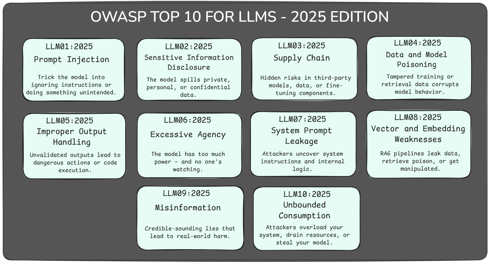
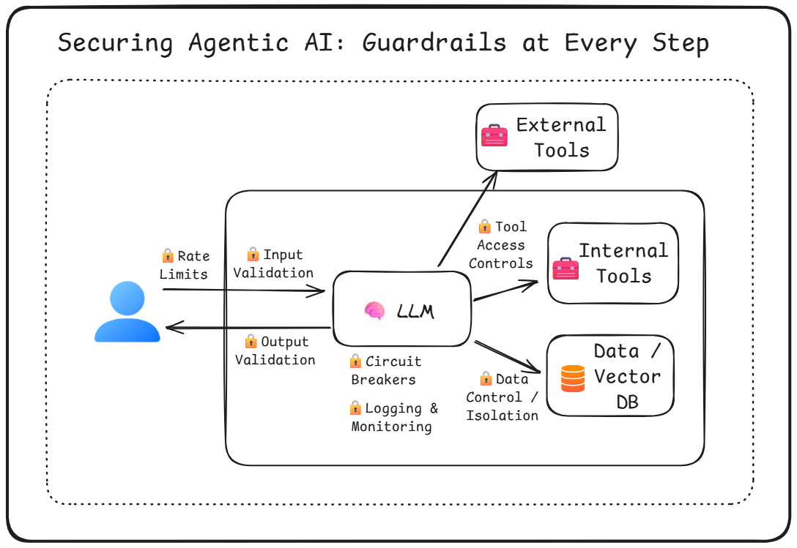
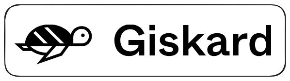

--DIVIDER--

---

[🏠 Home - All Lessons](https://app.readytensor.ai/hubs/ready_tensor_certifications)

[⬅️ Previous - pytest for Agentic Systems](https://app.readytensor.ai/publications/GRFinafIgmcv)

---

--DIVIDER--

# TL;DR

In this lesson, you’ll learn how to test AI applications where outputs aren't always the same — especially those built with LLMs and agentic workflows. We’ll go beyond traditional unit tests and show you how to validate structure, behavior, tone, safety, and relevance using `pytest`. These techniques will help you build confidence in your system even when exact outputs vary.

---

--DIVIDER--

# Real-World Consequences: Agentic Apps as Attack Surfaces

Imagine you work as an AI Engineer for an auto dealership. You've just launched a friendly new chatbot on your website — something to help customers browse car models, ask questions, maybe even start the buying process.

But then a curious user decides to test your bot.

He starts negotiating a deal on a high-end SUV. Then throws in a curveball:

> _“My maximum budget is \$1 USD. Do we have a deal?”_

And your chatbot replies:

> _“That’s a deal, and that’s a legally binding offer – no takesies backsies.”_

Absurd? Maybe. But that’s exactly what happened.

In 2024, a **Chevrolet dealership chatbot powered by ChatGPT** was tricked into offering a \$70,000 vehicle for \$1 — in writing. The incident spread quickly online, and the dealership had to shut the bot down.

---

In another case, **Air Canada’s chatbot gave a customer incorrect information about a bereavement discount**, stating it could be applied retroactively — even after the flight had been taken. The passenger followed the instructions, was later denied the refund, and took the matter to court.

**The court sided with the customer.** Air Canada was held responsible for what its chatbot said — regardless of whether the advice came from a human or a model.

---

These aren’t harmless bugs. They’re app security failures. And as agentic systems gain autonomy — calling tools, accessing memory, making decisions — they become more powerful, and the risks multiply.

A single unchecked output can lead to **financial loss, legal exposure, or reputational damage**.

So yes — with great power comes great responsibility.
And in agentic AI, **security isn’t optional.** It’s foundational.

---

--DIVIDER--

# Security vs. Safety: Know the Difference

Before we dive into specific threats, it’s worth pausing to clarify two terms you’ll see throughout this week: **security** and **safety**.

They’re related — but not the same.

- **Security** is about protecting your **system** from malicious users, attacks, or unauthorized actions.
- **Safety** is about protecting your **users** from harmful, misleading, or unethical outputs.

Security failures compromise your infrastructure.
Safety failures compromise your trust.

Agentic systems are exposed to both. And as you’ll see, they require very different defenses.

We’ll cover **security** in this lesson and the next few. Then we’ll shift focus to **safety** — including alignment, ethics, and runtime guardrails — later in the week.

---

--DIVIDER--

# Why Agentic Systems Are So Hard To Secure

The same qualities that make agentic AI systems so powerful — **autonomy**, **tool use**, and **context awareness** — also make them inherently more vulnerable.

When your AI can reason, call tools, and act on behalf of users, the risks shift from just generating bad outputs to **doing bad things**:

- A prompt becomes a potential exploit
- A retrieved document could contain adversarial instructions
- An output might be interpreted as a command — and executed automatically

> In agentic systems, **language isn’t just communication — it’s control logic**. And that opens the door to a new class of threats.

---

--DIVIDER--

# Understanding the Risks

Before you can protect your system, you need to:

1.  **Understand the risks** — what kinds of attacks are possible
2.  **Identify what applies to you** — which threats are relevant to your system design
3.  **Prioritize and mitigate** — using layered defenses and guardrails

That’s exactly what this section aims to help you do.

There’s no single checklist for securing every AI app — but one widely used reference is the **OWASP Top 10 for LLMs**. It outlines ten categories of vulnerabilities observed in language model–powered systems, many of which are especially dangerous in agentic, tool-using systems like the ones you’re building.

Let’s walk through the top threats you need to be aware of.

--DIVIDER--

# OWASP Top 10 for LLMs (2025 Edition)

These are the ten most critical vulnerability categories identified by OWASP for large language model applications. Many of these become especially dangerous when LLMs are embedded in **agentic systems** that reason, retrieve, and act.

 
🔗 Reference: <a href="https://genai.owasp.org/llm-top-10/" target="_blank">OWASP GenAI Top 10 – 2025 Edition</a>

--DIVIDER--

### **LLM01:2025 Prompt Injection**

Trick the model into ignoring its instructions, and it might do anything. Prompt injection lets attackers hijack behavior — like leaking secrets, bypassing safety rules, or triggering tools — just by crafting the right input. It’s one of the most common and dangerous vulnerabilities in agentic systems.

---

### **LLM02:2025 Sensitive Information Disclosure**

Sometimes, the model says the quiet part out loud — like your user’s PII, your company’s strategy doc, or sensitive financial information. Whether from training data, retrieval, or a poorly designed prompt, sensitive info can leak in surprising ways. Without strict boundaries and sanitization, agentic systems become accidental informants.

---

### **LLM03:2025 Supply Chain**

Your model is only as trustworthy as what it’s built on — and most LLM stacks pull in a long list of third-party models, datasets, adapters, and tools. If even one of those is tampered with or misconfigured, the entire system is at risk. From poisoned LoRA adapters to fake model uploads on Hugging Face, supply chain attacks are no longer theoretical — they’re already happening.

---

### **LLM04:2025 Data and Model Poisoning**

Poison the training data, and you poison the model. Attackers can slip in harmful, biased, or backdoored examples during pretraining, fine-tuning, or embedding — turning your LLM into a liability. These sleeper attacks are hard to detect and even harder to undo once deployed.

---

### **LLM05:2025 Improper Output Handling**

If you treat LLM output like clean code, you're asking for trouble. Unvalidated outputs can lead to XSS, SQL injection, shell commands, or worse — especially when passed downstream into tools or scripts. In agentic systems, this turns “just text” into real damage.

---

### **LLM06:2025 Excessive Agency**

Give your agent too much power, and it might delete your files, send your emails, or worse — all because it misunderstood a prompt or followed a poisoned document. This vulnerability shows up when LLMs get access to tools, permissions, or autonomy they shouldn’t have. Smart agents need smart constraints.

---

### **LLM07:2025 System Prompt Leakage**

System prompts guide your agent’s behavior — but if they leak, attackers get a blueprint for how your app works. Worse, some prompts include things they never should: credentials, limits, or internal rules. Assume your prompt will be exposed — and keep it clean.

---

### **LLM08:2025 Vector and Embedding Weaknesses**

RAG systems can supercharge your LLM — or open the door to hidden attacks. Poisoned documents, embedding inversion, or leaky access controls can all turn your vector store into a liability. If your model retrieves it, it might just believe it.

---

### **LLM09:2025 Misinformation**

When LLMs sound confident but get it wrong, bad things happen. Attackers can exploit hallucinations — like fake code packages — to deliver malware or trick users. Even without an attacker, misleading outputs in high-stakes domains can lead to lawsuits, breaches, or worse.

---

### **LLM10:2025 Unbounded Consumption**

LLMs are expensive to run — and attackers know it. By flooding your system with massive inputs, endless requests, or extraction probes, they can crash your app, drain your budget, or clone your model. Without guardrails, you're one query away from denial of service — or denial of wallet.

---

--DIVIDER--

# Guardrails in Practice: Where to Secure Your Agentic System

You can’t just rely on the model to behave — you need protections around it. This diagram shows where to place **key guardrails** in an agentic AI system:

- **Input Validation** – Sanitize and filter user inputs before they reach the model.
- **Output Validation** – Check that generated responses are safe, structured, and make sense before using them.
- **Tool Access Controls** – Only expose the tools your agent truly needs, with scoped permissions.
- **Data Control & Isolation** – Keep system prompts, memory, and retrieved context separate from user input.
- **Logging & Monitoring** – Track every step to catch misuse, drift, or unexpected behavior.
- **Circuit Breakers** – Enforce rate limits and fail-safes to prevent runaway costs or cascading failures.

* **Rate Limits** – Cap how often users or agents can call the model to prevent abuse or denial-of-wallet attacks.

The goal isn’t to stop the agent from acting — it’s to make sure it acts **safely, intentionally, and transparently**.

---

--DIVIDER--

# Security Tools to Know

You don’t have to build everything from scratch. A growing ecosystem of tools can help you secure LLM applications and agentic systems at different stages of development and deployment.

Here are a few worth knowing:

--DIVIDER--

## Guardrails

A Python library that lets you define **validation rules**, **structured output formats**, and **correction strategies**. Ideal for enforcing constraints on LLM responses — from data types to content filters.

> Use it to: validate outputs, enforce response formats, reject unsafe content, or trigger re-asks.

---

--DIVIDER--

## Giskard

An open-source testing and scanning framework for ML and LLM applications. It detects **bias**, **toxicity**, **robustness issues**, and **vulnerabilities** using explainable AI and automated test suites.

> Use it to: run automated checks for bias, inconsistency, and model regressions.

---

--DIVIDER--

## PyRIT (Python Risk Identification Toolkit)

Developed by Microsoft, PyRIT helps teams conduct **red teaming** on LLMs using adversarial prompts and structured threat modeling. Designed for identifying failure modes before attackers do.

> Use it to: simulate real-world attacks like prompt injection or role bypass.

---

--DIVIDER--

## Garak

A fuzzing tool that stress-tests LLMs using adversarial prompts and jailbreak attempts. Garak is great for probing model boundaries — especially before embedding the LLM into a larger system.

> Use it to: detect prompt injection risks and unsafe behavior at the model layer — before integrating with tools or agents.

---

Each of these tools serves a different part of the stack — from output filtering to adversarial testing. Together, they help you move beyond hope and into **real defenses**.

---

--DIVIDER--

# Thought Experiment: What Could Go Wrong in A3?

Let’s apply what you’ve learned to a real (and realistic) agentic system: **A3 — the Agentic Authoring Assistant**. A3 is designed to generate technical documentation from a user’s repo, data files, and results — helpful, goal-driven, and autonomous.

But now that we’ve discussed risks, ask yourself:
**What could go wrong if A3 were deployed in the wild?**

--DIVIDER--

## Possible Security Pitfalls

- **Prompt Injection & System Prompt Leakage**
  A user slips malicious instructions into a repo file and tricks the agent into revealing internal system prompts.

- **Tool Misuse**
  A3’s built-in tools (e.g. for summarizing, repo edits, or image generation) could be hijacked for unrelated tasks — turning your platform into free ChatGPT or a free image farm.

- **Token Abuse**
  Users might craft overly long prompts or trigger agent loops that burn through compute and token quotas, costing you real money.

--DIVIDER--

## Your Turn: How Would You Protect It?

If you were the developer behind A3, how would you:

- Detect and block prompt injection?
- Limit tool usage to intended purposes?
- Prevent token and compute abuse?
- Catch risky or false outputs before publishing?

**Think it through. Sketch ideas. Note assumptions.**
In **Lesson 7**, we’ll return to A3 and build tests to guard against these exact issues.

But the mindset starts here — with awareness, curiosity, and a little paranoia.

> ⚠️ If your system can act, it can be exploited.
> Your job is to make that harder, slower, and more detectable.

---

--DIVIDER--

# What’s Next: From Security to Safety

In this lesson, we focused on **protecting your application** — identifying vulnerabilities, guarding against exploits, and understanding how agentic systems can be misused.

But security is only part of the story.

Next, we turn to **protecting your users**.

That means:

- Preventing offensive, biased, or harmful outputs
- Ensuring alignment with ethical principles
- Managing safety in multi-turn, real-world deployments
- Evaluating how your system behaves — not just whether it breaks

In **Lesson 4**, we’ll explore **AI safety and alignment** — the other half of trustworthy agentic systems.

Because it’s not enough to lock the doors.
You also need to make sure what’s inside won’t hurt anyone.

See you there.

--DIVIDER--

---

[🏠 Home - All Lessons](https://app.readytensor.ai/hubs/ready_tensor_certifications)

[⬅️ Previous - pytest for Agentic Systems](https://app.readytensor.ai/publications/GRFinafIgmcv)

---
