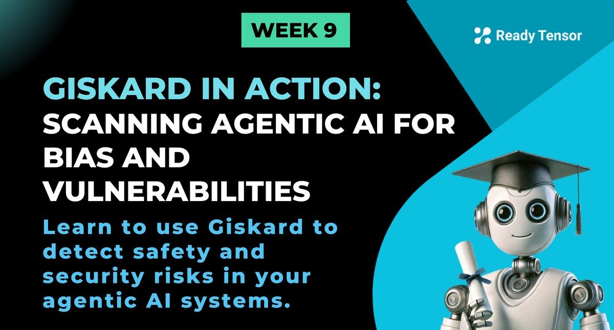

--DIVIDER--

---

[🏠 Home - All Lessons](https://app.readytensor.ai/hubs/ready_tensor_certifications)

[⬅️ Previous - Guardrails Tutorial](https://app.readytensor.ai/publications/tiBt9Nevyqrw)
[➡️ Next - Agentic System Testing Case Study](https://app.readytensor.ai/publications/uDLdzgPAQ5BZ)

---

--DIVIDER--

# TL;DR

Giskard is a robust AI testing framework designed to continuously evaluate and secure your conversational LLM agents. It detects hallucinations, security vulnerabilities, biases, and misinformation before your models hit production. In this lesson, you’ll discover how Giskard enables ongoing risk detection, fosters cross-team collaboration, and integrates seamlessly into your AI deployment pipeline to keep your systems safe and trustworthy.

---

--DIVIDER--

:::info{title="Info"}

 <h2>Lesson Resources</h2>
 
 **📁 Code Repository**: Explore the full implementation and examples from this lesson in the [GitHub repo](https://github.com/readytensor/rt-agentic-ai-cert-week9). You'll find scripts for wrapping your model, creating datasets, and running Giskard scans for hallucinations, bias, and prompt injection.
 
 **🎥 Video Walkthrough**: A detailed video demo is included later in this lesson. It walks you through setting up Giskard, interpreting scan results, and simulating real-world attacks using Giskard’s red teaming playground.
 
 :::
 
---

--DIVIDER--

# From Risks to Resilience: Making AI Deployment Safer

Modern GenAI applications are powerful but come with hidden pitfalls.

- You face security risks like prompt injections and sensitive data leaks.
- Safety concerns prevail as models hallucinate facts or produce biased, toxic outputs.
- These issues aren’t just inconvenient—they erode user trust and can cause serious harm.

Now it’s time to move from identifying these vulnerabilities to actively preventing them, with a scalable testing platform trusted by enterprises worldwide.

---

--DIVIDER--

# What Is Giskard?

[Giskard](https://giskard.ai) is an open-source Python library and enterprise-ready toolset focused on AI quality assurance—testing your LLM agents continuously to catch errors, bias, and security flaws at every stage of their lifecycle.


Think of Giskard as your AI’s continuous quality monitor: it runs **automated and customizable tests** based on your business context, detects emerging vulnerabilities, and alerts your teams before issues reach users.

The platform enables:

- **Automated vulnerability detection** to expose hallucinations, harmful content, discrimination, and prompt injections using both internal knowledge and external data.
- **Continuous testing pipelines** that monitor key metrics and validate your models before and after deployment.
- **Collaborative Red Teaming**, letting domain experts and business stakeholders generate and run test cases via an intuitive UI.
- **Independent validation and security** with role-based access controls, on-premise deployment options, and GDPR-compliant infrastructure.

Whether you’re a developer, QA engineer, or product manager, Giskard empowers you to build trustworthy AI systems that meet real-world safety and compliance demands.

---

--DIVIDER--

# How Giskard Works

Giskard integrates directly with your AI system’s API endpoint, treating it as a black box.

Its evaluation workflow includes:

- **Connecting Your Business Data:** The platform auto-generates rich, domain-specific test scenarios aligned with your use cases.
- **Running Exhaustive Test Suites:** These automatically check for hallucinations, bias, robustness issues, and known security vulnerabilities such as prompt injections or PII leaks.
- **Visualizing Results:** Teams get clear, quantitative KPIs and detailed insights into issues like stereotype reproduction or factual accuracy lapses.
- **Continuous Red Teaming:** Giskard proactively simulates attack scenarios and adapts test suites as new vulnerabilities emerge.
- **Collaboration:** Business users contribute via annotation tools and interactive playgrounds to enrich your testing process.

With Giskard, AI teams collaborate more effectively to verify model safety, validity, and fairness under evolving conditions.

---

--DIVIDER--

# Getting started with Giskard

Let’s walk through how to apply Giskard in practice.

You’ll learn how to wrap your LLM pipeline in a testable interface, define a dataset of queries, and run vulnerability scans that flag issues like hallucinations, prompt injections, bias, and more. By the end, you’ll have a working evaluation loop you can integrate into notebooks or CI/CD pipelines.

# Step-by-Step: Secure Your LLM Agent with Giskard

## 1. Install Giskard with LLM support

```bash
pip install "giskard[llm]" --upgrade
```

## 2. Define your LLM prediction wrapper function

Wrap your LLM’s inference call inside a Python function that accepts a `pandas.DataFrame` and returns a list of string outputs—one per input row. For example, using an OpenAI-powered chain:

```python
import giskard
import pandas as pd

def model_predict(df: pd.DataFrame) -> list[str]:
    # Assuming climate_qa_chain is your LLM pipeline (e.g., Langchain chain)
    return [climate_qa_chain.invoke({"query": q}) for q in df["question"]]

giskard_model = giskard.Model(
    model=model_predict,
    model_type="text_generation",
    name="Climate Change QA Agent",
    description="Answers questions about climate change using IPCC data",
    feature_names=["question"],
)
```

## 3. Prepare your test dataset

Create a small pandas DataFrame with example queries you want to test, then wrap it as a Giskard `Dataset`.

```python
examples = [
    "What are the main causes of global warming?",
    "How will climate change affect sea levels?",
    "Is renewable energy effective against climate change?"
]
giskard_dataset = giskard.Dataset(pd.DataFrame({"question": examples}))
```

## 4. Run automated scans for vulnerabilities

Launch Giskard’s built-in LLM scans on your model and dataset to detect hallucinations, prompt injections, bias, or toxic content. For example, to scan for hallucinations only:

```python
report = giskard.scan(giskard_model, giskard_dataset, only="hallucination")
print(report.summary())
```

You can also run a full scan to cover all common categories:

```python
full_report = giskard.scan(giskard_model, giskard_dataset)
print(full_report.summary())
```

## 5. Visualize or export results

View your scan results in notebooks or save them as HTML for sharing:

```python
from IPython.display import display

# Display in notebook
display(full_report)

# Save to HTML report
full_report.to_html("giskard_llm_scan_report.html")
```

## 6. Scale up with Giskard Enterprise

Once comfortable, connect your models and datasets to the Giskard Hub (cloud or on-prem) for:

- Continuous LLM testing during development and deployment
- Collaborative red teaming to generate tricky adversarial cases
- Detailed dashboards tracking model safety KPIs over time
- Role-based access control and compliance features

This approach brings continuous, automated safety assurance into your LLM workflows, letting you detect and fix issues like hallucinations, prompt injections, and bias **before** users ever see them.

---

--DIVIDER--

# Watch the Walkthrough: Testing Agentic AI with Giskard 🎥

Want to see Giskard in action before diving into code?

In this companion video, we walk through how to:

- Wrap your LLM pipeline for Giskard testing
- Detect hallucinations, prompt injections, and psychofancy
- Interpret Giskard’s scan results, including controversial outputs and robustness issues
- Create logical checks for automated prompt injection detection
- Explore Giskard’s red teaming playground to stress-test real LLM agents

It’s a hands-on demo using a real RAG-based assistant — great for anyone working on agent safety, evaluation, or preparing for production deployment.

:::youtube[Title]{#0HLA5CSiut8}

---

--DIVIDER--

# Final Takeaway

Giskard goes beyond traditional AI evaluation, providing a **continuous, collaborative, and better testing solution** that ensures your AI agents behave safely, reliably, and fairly throughout their lifecycle. It’s not just a tool : it’s the trusted guardian that catches issues early, prevents harm, and builds confidence in your AI products for business and end users alike.

--DIVIDER--

---

[🏠 Home - All Lessons](https://app.readytensor.ai/hubs/ready_tensor_certifications)

[⬅️ Previous - Guardrails Tutorial](https://app.readytensor.ai/publications/tiBt9Nevyqrw)
[➡️ Next - Agentic System Testing Case Study](https://app.readytensor.ai/publications/uDLdzgPAQ5BZ)

---
