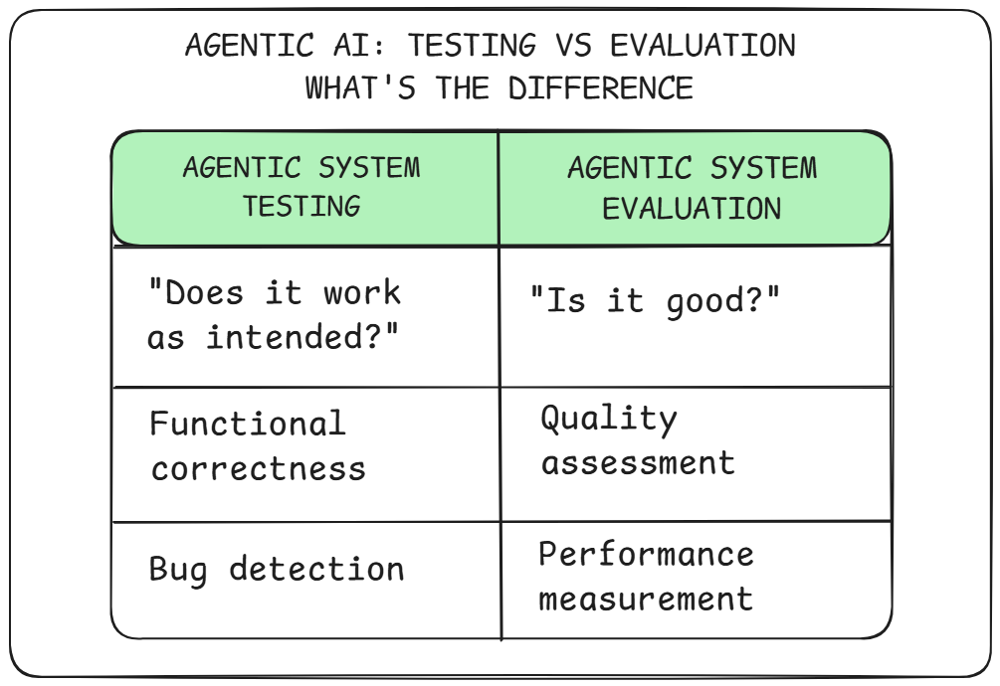

--DIVIDER--

---

[🏠 Home - All Lessons](https://app.readytensor.ai/hubs/ready_tensor_certifications)

[⬅️ Previous - Giskard Tutorial](https://app.readytensor.ai/publications/4PVxbVYFrLVO)
[➡️ Next - Week 10 Preview](https://app.readytensor.ai/publications/cPsF3K8r69bd)

---

--DIVIDER--

# TL;DR

In this lesson, you’ll walk through a real case study of how we tested a multi-agent LLM system built with LangGraph. Using Pytest, we implemented unit tests for deterministic components, mocked LLM responses for critical nodes, and ran integration tests to validate semantic quality and behavior. This hands-on guide will help you apply the same testing strategies to your own agentic AI systems.

---

--DIVIDER--

# From Theory to Test Suite

Over the past few lessons, you've explored how to test agentic AI systems from multiple angles. You've learned how to validate outputs that vary, enforce structure and tone, defend against harmful inputs, and monitor runtime behavior — all critical for making LLM-based systems production-ready.

:::info{title="Info"}

 <h2>New to this series?</h2>
 
 Don't worry — this lesson is designed to stand alone. While it builds on testing concepts from earlier in the week, we'll explain everything you need to follow along and apply these techniques to your own systems.
 
 :::
 
 But now it's time to put those concepts into practice.
 
 In this final lesson of Week 9, we'll walk through how we tested a real, multi-agent AI system built with LangGraph. You'll see:
 
 - How we wrote unit tests for classic logic components
 - How we mocked LLMs to isolate node behavior  
 - How we ran integration tests using real LLM calls (and semantic checks)
 - Where performance testing and safety validation fit into the pipeline
 
 This isn't just about hitting 80% test coverage — it's about building confidence that our system **works as designed**. We're focusing on testing here — ensuring our multi-agent system functions correctly, handles edge cases gracefully, and maintains quality standards in production.
 
 **A note on approach:** While we're using our A3 authoring assistant as the example, the testing strategies and patterns you'll learn apply to any multi-agent LLM system. Think of this as your blueprint for testing complex agentic workflows.
 
 Ready? Let's meet the system.
 
 ---

--DIVIDER--

# The Multi-Agent System Under Test

For this case study, we’ll be testing the **Agentic Authoring Assistant (A3)** — a LangGraph-based system that helps users polish and enrich their AI/ML publications.

Rather than generating full articles, A3 produces supporting metadata that improves clarity, discoverability, and structure. From a single input (typically a project description or article body), the system generates:

- A clear, professional **title**
- A short, informative **TL;DR**
- A list of relevant **tags**
- A curated set of **references**

Each output is created by a dedicated agent, all working in parallel from shared context. The flow is managed by a **supervisor-style architecture**:

- A **Manager** agent summarizes the input
- Generator agents (title, TL;DR, references) act independently
- A **Reviewer** agent evaluates all outputs for quality
- Any rejected content is routed back for revision

Here’s the architecture at a glance:


---

# Why This System Represents Many Agentic Workflows

Although A3 is tailored for authoring, its architecture reflects common patterns found in agentic AI systems:

- Specialized agents performing focused tasks
- Shared memory or brief created by a coordinator
- Final-stage review or control logic
- A mix of deterministic and LLM-driven components
- Iteration loops based on feedback or quality checks

If your system includes similar ingredients, the techniques we’ll explore — especially around how to test functionality, not just quality — will be directly relevant.

Before we dive into those techniques, let’s clarify one thing:
**Testing is not the same as evaluation.**

---

--DIVIDER--

# Testing ≠ Evaluation: Different Tools, Different Goals

Before we dive into the test suite, it’s worth drawing a clear line between **testing** and **evaluation** — especially in the context of LLM-based systems.

Both are essential. But they serve different purposes:

- **Testing** answers the question: _“Does the system work as intended?”_
  It checks for bugs, regressions, misbehavior, and logic errors. Testing is about functionality, not performance.

- **Evaluation** answers the question: _“How well does the system perform?”_
  It assesses quality, faithfulness, coherence, and user alignment — often using metrics like semantic similarity or human preference scores.



Here’s a simple way to think about it:

> 🛠 **Testing** helps you know whether your system is **bug-free.**
> 🧪 **Evaluation** helps you know whether your system is **good.**

So while we might use techniques like semantic similarity or keyword checks during testing, the bar is much lower. In testing, we’re not chasing a 90% faithfulness score — we’re just verifying that it didn’t hallucinate something completely wrong.

For example:

- ✅ Test: "Title must include at least one key concept from the input."
- ❌ Evaluate: "Title must rank above 0.85 in average cosine similarity to ground truth."

This distinction is especially important when working with LLMs. If you start tweaking your prompts or agent behavior based on low evaluation scores inside your test suite, you're no longer testing — you’re **optimizing**. That belongs in a different workflow.

We’ll show how we keep these lines clear in the next section.

---

--DIVIDER--

# Our Testing Strategy: Unit Tests, Mocks, and Integration Checks

The A3 system isn’t a single LLM call — it’s a **multi-agent workflow** with stateful routing, iterative feedback, and chained interactions. That makes testing more complex than writing a few `assert` statements. To keep things robust, we built a layered testing strategy with three key levels:

--DIVIDER--

 <h2> 1. Unit Tests for Deterministic Components </h2>
 
 Wherever logic is fixed and predictable, we wrote classic unit tests:
 
 - Input validation checks (e.g., rejecting empty or whitespace-only content)
 - Structural assertions (e.g., response contains expected keys and types)
 - Small pure functions (e.g., helper utilities for message construction)
 
These tests are fast, reliable, and form the foundation of the suite. When something breaks, they’re often your first clue.

--DIVIDER--

 <h2> 2. Unit Tests for LLM-Backed Nodes (with Mocks) </h2>
 
 Most nodes in A3 use LLMs — which means outputs vary. But we don’t want flaky tests that fail just because the model phrased something differently.
 
 So we **mocked LLM responses** during unit tests for LLM-backed nodes. This let us:
 
 - Focus on how the node **processes** the LLM output (not what it says)
 - Ensure nodes return clean, structured outputs
 - Validate fallback behavior (e.g., what happens when the LLM returns only whitespace)
 
 Mocking gave us confidence that each node would behave correctly in isolation — no actual model call required.

--DIVIDER--

 <h2> 3. Integration Tests with Real LLM Calls </h2>
 
 To test the full system behavior, we also wrote **integration tests** that run real LangGraph nodes and call actual LLMs. These tests let us check:
 
 - That outputs are semantically aligned with the input (using embedding-based similarity)
 - That they meet structural and formatting expectations
 - That the output is semantically valid, often by checking for the presence of expected terms or phrases
 
 We used tools like Hugging Face embeddings for vector similarity and rule-based checks to confirm that each node’s output was semantically relevant and structurally correct — helping us ensure the logic behaves as intended when real model calls are involved.
 
 > 🧠 Remember: In testing, we don’t evaluate quality the same way we do during system evaluation. We’re not tuning the model — we’re verifying it didn’t break. For example, if the input text is about Transformers and BERT, and the generated title is “Advances in BERT for NLP”, that’s a pass. If it says “How to Bake a Cake”, something clearly went wrong. We’re checking for logical alignment, not excellence.

--DIVIDER--

<h2> Exercises for the Reader: Tests Worth Adding </h2>
 
 While we didn’t add them to this case study, your full test suite should also include:
 
 - **Performance tests**: How long does it take to respond? How much memory does it use? Especially relevant if you’re hosting your own model (like LLaMA 3 or Qwen).
 - **End-to-end tests**: Validate user flows across the entire app — not just individual components.
 - **Security and safety tests**: Covered earlier this week, but worth adding to your suite (e.g., prompt injection resistance, refusal behavior, profanity detection, etc.).
 
 We encourage you to treat this list as your stretch goals — essential additions that will strengthen confidence in your system as it moves toward production.
 
 ---

--DIVIDER--

# Unit Tests for Deterministic Components

Even in agentic systems, not everything needs an LLM call. Agentic workflows often include supporting functions and utilities that can — and should — be tested the traditional way.

In agentic systems, this often includes things like:

- **State Initialization**: Functions that set up default values, keys, or routing metadata before the graph starts.
- **Utility Functions**: File I/O, prompt construction, schema validation, or text normalization.
- **Custom Tools or APIs**: Any function that performs a deterministic task outside of LLMs (e.g., search, tagging, parsing).
- **Non-LLM Nodes**: Some nodes are just logic — no model call involved. These can (and should) be tested like regular components.

In our case, we had a few such components in A3 that were tested this way:

- A **prompt builder** that assembled structured prompts from modular config values — ensuring consistent formatting across agents.
- A **web search utility** that queried Tavily and returned relevant results — used by the References Generator agent to find external content.
- A **tag extraction node** built using spaCy, which ran outside the LLM pipeline but was still part of the LangGraph system.
- A **state initializer** that set up the graph’s shared memory structure, ensuring that all keys were defined and default values were in place.

Each of these was tested with pure `pytest` unit tests — no mocks, no LLMs, just regular assertions.

---

--DIVIDER--

 <h2> Example 1: Web Search Tool (Tavily)</h2>
 
 This function takes a list of queries, sends them to the Tavily API, and returns a list of search results. It’s used by one of our agents — but is itself just a tool.
 
 Here's the core function:
 
 ```py
 def execute_search_queries(
     queries: List[str], max_results: int = 3
 ) -> List[Dict[str, str]]:
     """
     Execute a list of search queries and return aggregated results.
 
     Args:
         queries: List of search query strings
         max_results: Maximum results per query
 
     Returns:
         List of search results with url, title, and page_content
     """
     # Handle None input gracefully
     if queries is None:
         print("⚠️ Warning: No search queries provided (None input)")
         return []
 
     # Handle non-list input gracefully
     if not isinstance(queries, (list, tuple)):
         print(f"⚠️ Warning: Expected list of queries, got {type(queries).__name__}")
         return []
 
     # Filter out empty/whitespace queries upfront
     valid_queries = [query.strip() for query in queries if query and query.strip()]
 
     if not valid_queries:
         print("⚠️ Warning: No valid search queries provided (empty or whitespace-only)")
         return []
 
     print(f"🔍 Executing {len(valid_queries)} search queries...")
     search_results = []
 
     for query in valid_queries:
         print(f"🔍 Executing query: {query}")
         try:
             result = TavilySearch(max_results=max_results).invoke(query)["results"]
             search_results.extend(result)
             print(f"✅ Successfully executed query: {query}")
         except Exception as e:
             print(f"❌ Error executing query '{query}': {e}")
             continue
 
     # Filter and format results
     formatted_results = [
         {
             "url": search_result["url"],
             "title": search_result["title"],
             "page_content": search_result["content"],
         }
         for search_result in search_results
         if search_result.get("content")  # Ensure content is not empty
     ]
 
     return formatted_results
 ```
 
 This function is responsible for taking a list of search queries, and returning a list of search results with URLs, titles, and content.
 
 Here are the kinds of tests we wrote:
 
 - Returning correctly formatted results
 - Filtering empty or malformed content
 - Handling whitespace-only or invalid queries
 - Passing and respecting parameters like max_results
 - Aggregating results from multiple queries
 - Handling API failures gracefully
 - Supporting edge cases like `None` inputs or unexpected types
 
 These are traditional unit tests that ensure the function behaves correctly regardless of the LLMs involved. They validate the logic, not the output quality (i.e. not the quality of the search results themselves).
 
 Let’s look at one of those tests:
 
 ```python
 def test_execute_search_queries_filters_empty_content(monkeypatch):
     """Test that function filters out results with empty content."""
     mock_tavily_response = {
         "results": [
             {"url": "https://example1.com", "title": "Valid", "content": "Valid content"},
             {"url": "https://example2.com", "title": "Empty", "content": ""},
             {"url": "https://example3.com", "title": "Missing"},  # No content key
             {"url": "https://example4.com", "title": "None", "content": None},
         ]
     }
 
     mock_tavily = MagicMock()
     mock_tavily.return_value.invoke.return_value = mock_tavily_response
     monkeypatch.setattr("nodes.node_utils.TavilySearch", mock_tavily)
 
     results = execute_search_queries(["AI"])
     assert len(results) == 1
     assert results[0]["title"] == "Valid"
 
 ```
 
 This test ensures that the `execute_search_queries` function properly **filters out search results that have empty, missing, or `None` content**. It simulates a response from the Tavily API with a mix of valid and invalid entries, then checks that only the valid one is returned. This helps maintain the **quality of retrieved content** before it’s passed to downstream components like the References Generator agent.
 
 ---

--DIVIDER--

<h2> Example 2: spaCy Tag Extraction Node</h2>
 
 We had a node that used a preloaded spaCy pipeline to extract noun chunks and candidate tags from a block of text — no model call required.
 
 the core node function looked like this:
 
 ```python
 
 
 def make_spacy_tag_generator_node() -> Callable[[Dict[str, Any]], Dict[str, Any]]:
     """
     Returns a LangGraph-compatible node that extracts tags using a pre-loaded spaCy model.
     """
     model = spacy.load("en_core_web_trf")
 
     def spacy_tag_generator_node(state: TagGenerationState) -> Dict[str, Any]:
         """
         Extracts unique named entities from the input text using spaCy.
         """
         input_text = state.get(INPUT_TEXT, "")
 
         # Handle edge cases gracefully
         if not input_text or not input_text.strip():
             return {SPACY_TAGS: []}
 
         doc = model(input_text)
         seen = set()
         entities = []
         for ent in doc.ents:
             if ent.label_ in EXCLUDED_SPACY_ENTITY_TYPES:
                 continue
             key = (ent.text.lower(), ent.label_)
             if key not in seen:
                 seen.add(key)
                 entities.append(
                     {
                         "name": ent.text.lower().strip(),
                         "type": ent.label_.strip(),
                     }
                 )
         return {SPACY_TAGS: entities}
 
     return spacy_tag_generator_node
 
 ```
 
 We tested:
 
 - Basic functionality: returns non-empty tag list for valid input
 - Handles empty or whitespace input gracefully
 - Tag results are strings, lowercased, and deduplicated
 - Handles long or noisy text without crashing
 - Edge case: skips non-English input
 
 Here’s a few representative tests:
 
 ```python
 
 @pytest.fixture
 def simple_tag_state():
     return TagGenerationState(
         input_text="OpenAI is based in San Francisco. It was founded in 2015.",
         llm_tags_gen_messages=[],
         tag_type_assigner_messages=[],
         tags_selector_messages=[],
         llm_tags=[],
         spacy_tags=[],
         gazetteer_tags=[],
         candidate_tags=[],
         selected_tags=[],
         max_tags=5,
         tag_types=[],
     )
 
 @pytest.fixture(scope="module")
 def spacy_node():
     """Use a fixture because the node is expensive to create - involves model loading."""
     return make_spacy_tag_generator_node()
 
 
 def test_spacy_detects_named_entities(spacy_node, simple_tag_state):
     simple_tag_state["input_text"] = (
         "Hugging Face released a new model using PyTorch and trained on CIFAR-10."
     )
     result = spacy_node(simple_tag_state)
     tags = result[SPACY_TAGS]
 
     assert isinstance(tags, list)
     assert any("hugging face" in tag["name"] for tag in tags)
 
 
 def test_spacy_excludes_dates_and_cardinals(spacy_node, simple_tag_state):
     simple_tag_state["input_text"] = (
         "The model was trained for 10 days and tested on January 1, 2024."
     )
     result = spacy_node(simple_tag_state)
     tags = result[SPACY_TAGS]
 
     for tag in tags:
         assert tag["type"] not in {"DATE", "CARDINAL"}
 
 
 def test_spacy_deduplicates_entities(spacy_node, simple_tag_state):
     simple_tag_state["input_text"] = (
         "We used in our PyTorch experiments. PyTorch is a great framework. PyTorch is used widely."
     )
     result = spacy_node(simple_tag_state)
     tags = result[SPACY_TAGS]
 
     # Ensure only one unique entry for "pytorch"
     names = [tag["name"] for tag in tags]
     assert names.count("pytorch") == 1
 ```
 
 These tests ensure that the spaCy node behaves correctly, returning structured tags while handling edge cases like empty input or duplicate entities. They validate the logic of this non-LLM node. Spacy uses a pre-trained keyword extraction model, so we don’t need to mock anything here — we just check that the logic works as expected.
 
---

--DIVIDER--

 <h2>💡 Takeaway</h2>
 
 If a component doesn’t involve an LLM call — test it like any other backend service.
 
 > ✅ **Don’t skip these tests** just because your system is “AI.” Good coverage on traditional logic helps isolate issues and speeds up debugging when something breaks downstream.
 
 Up next: let’s talk about how to test the **LLM-powered nodes** — without depending on fragile outputs.
 
 ---

--DIVIDER--

# Unit Tests for LLM-Backed Nodes (with Mocks)

While traditional unit tests work well for deterministic logic, most agentic systems include components that call LLMs — and those outputs vary. That means you can’t write tests expecting the same exact result every time. Instead, we mock the LLM response so we can test how our system **behaves** around it.

In agentic nodes, you typically want to test logic on both sides of the LLM call:

- **Before the call**: Is the input being constructed correctly? Are invalid inputs (like empty text) being caught early?
- **After the call**: Is the output from the LLM being processed correctly? Are malformed results being handled gracefully?

By mocking the LLM, we gain control over these scenarios — and can write clean, deterministic tests.

---

 <h2>🧠 What We're Testing (Even With a Mock)</h2>
 
 In most LLM-backed nodes, there are **at least three things** worth testing:
 
 1. **Message Construction**
    Are we passing the right messages or inputs to the LLM?
 
 2. **Output Validation**
    Can we safely handle and clean the LLM’s output, even if it’s messy?
 
 3. **Fallback Behavior**
    What happens when the model returns something unexpected (or nothing at all)?
 
 Let’s walk through a real example.
 
---

--DIVIDER--

 <h2>🧪 Example 3: Tag Generator Using an LLM</h2>
 
 One of the nodes in our system extracts relevant entities and tags using an LLM. The input is a block of text (like a project description), and the output is a structured list of tags.
 
 Here’s what the node looks like (simplified):
 
 ```python
 from pydantic import BaseModel, Field
 
 class Entity(BaseModel):
     name: str = Field(description="The entity name")
     type: Optional[str] = Field(
         description="The entity type or 'Other' if not confidently classified."
     )
 
 
 class Entities(BaseModel):
     entities: List[Entity] = Field(
         description="The extracted entities. Can be empty if no entities are found.",
     )
 
 def make_llm_tag_generator_node(
     llm_model: str,
 ) -> Callable[[Dict[str, Any]], Dict[str, Any]]:
     """
     Returns a LangGraph-compatible node that extracts tags from the input text.
     """
     llm = get_llm(llm_model)
 
     def llm_tag_generator_node(state: TagGenerationState) -> Dict[str, Any]:
         """
         Extracts tags from the input text using the LLM.
         """
         # Prepare the input for the LLM
         input_text = state[INPUT_TEXT]
         if input_text is None or input_text.strip() == "":
             raise ValueError("Input text cannot be empty or None.")
         input_messages = [
             *state[LLM_TAGS_GEN_MESSAGES],
             _get_manager_brief_message(state),
             _get_input_text_message(state),
             _get_begin_task_message(),
         ]
         tags = (
             llm.with_structured_output(Entities)
             .invoke(input_messages)
             .model_dump()["entities"]
         )
 
         cleaned_tags = []
         for tag in tags:
             if not tag.get("name"):  # name is required
                 continue
             name = tag["name"].lower().strip()
             if not name:
                 continue
             tag_type = tag.get("type", "").lower().strip()
             cleaned_tags.append({"name": name, "type": tag_type})
 
         return {LLM_TAGS: cleaned_tags}
 
     return llm_tag_generator_node
 ```
 
 The function `make_llm_tag_generator_node` is a constructor that returns a LangGraph-compatible agent node.
 
 This agent node uses an LLM to generate a list of tags based on the input text. It constructs a message sequence, invokes the LLM, and processes the output into a structured format. There is a lot of logic here **before** and **after** the LLM call. That’s exactly why mocking is so helpful — we want to test these logic paths without relying on a live model.
 
 ---
 
 <h3> ✅ What We Tested </h3>
 
 Here’s a list of unit tests we wrote for this node:
 
 - Constructs the correct message sequence
 - Cleans up names and types from the model
 - Ignores missing, empty, or whitespace-only names
 - Handles malformed entities (missing keys, invalid types)
 - Handles `None` values in name/type
 - Handles long tag names or special characters
 - Returns empty list if LLM returns no tags
 - Raises clean errors for invalid input
 - Propagates LLM-side exceptions properly
 - Handles large entity lists efficiently
 
 ---

--DIVIDER--

 <h3> 🔍 Test 1: Tag Cleanup and Output Formatting </h3>
 
 ```python
 def test_llm_tag_generator_node_returns_cleaned_tags(monkeypatch):
     mock_invoke_output = {
         "entities": [
             {"name": "MNIST ", "type": "Dataset "},
             {"name": "transformer", "type": "Algorithm"},
         ]
     }
 
     mock_llm = MagicMock()
     mock_llm.with_structured_output.return_value.invoke.return_value.model_dump.return_value = mock_invoke_output
     monkeypatch.setattr("nodes.tag_generation_nodes.get_llm", lambda _: mock_llm)
 
     node = make_llm_tag_generator_node("mock-model")
     result = node({
         LLM_TAGS_GEN_MESSAGES: ["some message"],
         INPUT_TEXT: "Sample input text",
         MANAGER_BRIEF: "manager's brief",
     })
 
     assert result[LLM_TAGS] == [
         {"name": "mnist", "type": "dataset"},
         {"name": "transformer", "type": "algorithm"},
     ]
 ```
 
 ✅ **What this test confirms:**
 
 - The model's output is normalized: names are lowercased and whitespace trimmed.
 - Both `name` and `type` are present and processed.
 - The logic after the LLM call behaves as expected — even if the formatting is sloppy.
 
---

--DIVIDER--

 <h3> 🔍 Test 2: Malformed Tags Are Handled Gracefully </h3>
 
 ```python
 def test_llm_tag_generator_node_ignores_malformed_tags(monkeypatch):
     malformed_response = {
         "entities": [
             {"name": "transformer", "type": "Algorithm"},  # valid
             {"name": "mnist"},  # missing type
             {"type": "dataset"},  # missing name
             {},  # empty object
         ]
     }
 
     mock_llm = MagicMock()
     mock_llm.with_structured_output.return_value.invoke.return_value.model_dump.return_value = malformed_response
     monkeypatch.setattr("nodes.tag_generation_nodes.get_llm", lambda _: mock_llm)
 
     node = make_llm_tag_generator_node("mock-model")
     result = node({
         LLM_TAGS_GEN_MESSAGES: ["system"],
         INPUT_TEXT: "text here",
     })
 
     assert result[LLM_TAGS] == [
         {"name": "transformer", "type": "algorithm"},
         {"name": "mnist", "type": ""},
     ]
 ```
 
 ✅ **What this test confirms:**
 
 - Tags without a `name` are dropped entirely.
 - Tags without a `type` are still included, with `type` defaulted to an empty string.
 - Completely empty entries are ignored.
 
---

--DIVIDER--

 <h2> 💡 Takeaway </h3>
 
 LLMs don’t always behave the way we want — and that’s fine. Our job is to make sure the **system behaves** correctly around them.
 
 > ✅ Mock LLM responses so you can test structure, logic, and fallback behavior — without depending on real outputs.
 
 Next up, we’ll see how to validate those same nodes **with real LLM calls** — and still write tests that pass reliably.
 
 ---

--DIVIDER--

# Integration Tests with Live LLM Calls

So far, we’ve tested our agentic components by mocking LLM calls — but mocks can only take us so far. At some point, you need to run the **real model** and see if your logic holds up.

These are **integration tests** — and they’re essential for validating how your system behaves when real LLM outputs flow through it.

But they come with new challenges. Let’s break it down.

---

 <h2> 🧠 What We’re Testing For </h2>
 
 These tests are still focused on **functionality**, not performance. We’re not measuring how _good_ the results are — we’re verifying:
 
 - Are the outputs **semantically relevant** to the input?
 - Are they **structurally valid** (correct keys, formats)?
 - Do they respect **basic constraints** (length, presence of required elements)?
 - Do they avoid **obvious failures** (like empty strings or hallucinations)?
 
 In short, we’re checking if our system works as intended when the LLM is actually involved.
 
---

--DIVIDER--

 <h2> 🧪 Integration Example 1: Manager Node </h2>
 
 We have a Manager node whose role is to generate a brief (i.e. a memo) to send to the worker agents. It summarizes the input text and provides context for the generation of various components such as title, tags, tldr, and references.
 
 Here is its definition:
 
 ```py
 
 def make_manager_node(llm_model: str) -> Callable[[Dict[str, Any]], Dict[str, Any]]:
     """
     Returns a LangGraph-compatible node that wraps a manager node.
     """
     llm = get_llm(llm_model)
 
     def manager_node(state: A3SystemState) -> Dict[str, Any]:
         """
         Manager node that processes the input text and generates messages.
         """
         # Prepare the input for the LLM
         input_text = state[INPUT_TEXT]
         if input_text is None or input_text.strip() == "":
             raise ValueError("Input text cannot be empty or None.")
         input_messages = [
             *state[MANAGER_MESSAGES],
             _get_input_text_message(state),
             _get_begin_task_message(),
         ]
 
         ai_response = llm.invoke(input_messages)
         if ai_response.content is None:
             print("⚠️ Manager: LLM returned None content, using empty string")
             return {MANAGER_BRIEF: ""}
 
         return {MANAGER_BRIEF: ai_response.content.strip()}
 
     return manager_node
 ```
 
 The logic is generic because the main functionality is driven by the prompts (system and user messages) that are passed to the LLM. The node constructs a message sequence, invokes the LLM, and returns the generated brief. Let's see how we can test this node with an integration test that uses a live LLM.
 
 **Sample Test Code:**
 
 ```python
 
 @pytest.fixture(scope="session")
 def hf_embedder():
     """
     Session-scoped fixture to load HuggingFace embedder once for all integration tests.
     """
     return HuggingFaceEmbeddings(model_name="sentence-transformers/all-MiniLM-L6-v2")
 
 
 @pytest.mark.integration
 def test_manager_brief_generation(example1_data, hf_embedder, a3_config):
     """
     Test that the manager brief is semantically similar to the expected brief.
 
     Args:
         example1_data: Tuple containing input markdown and expected JSON.
         hf_embedder: HuggingFace embedder for semantic similarity scoring.
         a3_config: System configuration for agent selection.
 
     Asserts:
         - Non-empty manager brief is generated.
         - Semantic similarity > 0.5.
         - At least 50% of expected keywords appear.
         - Word count is between 100 and 350.
     """
     input_text, expected = example1_data
     expected_brief = expected.get("manager_brief", "")
     expected_keywords = expected.get("manager_brief_expected_keywords", [])
 
     state = initialize_a3_state(config=a3_config, input_text=input_text)
 
     node = make_manager_node(llm_model=a3_config["agents"]["manager"]["llm"])
     result_state = node(state)
     generated_brief = result_state.get(MANAGER_BRIEF, "")
 
     assert generated_brief, "Generated manager_brief is empty."
 
     similarity = embed_and_score_similarity(
         generated_brief, expected_brief, hf_embedder
     )
     assert similarity > 0.5, f"Low semantic similarity: {similarity:.2f}"
 
     # At least 50% of expected keywords should be present
     lowered_brief = generated_brief.lower()
     missing_keywords = [
         kw for kw in expected_keywords if kw.lower() not in lowered_brief
     ]
     coverage_ratio = (
         1 - (len(missing_keywords) / len(expected_keywords))
         if expected_keywords
         else 1.0
     )
 
     assert coverage_ratio >= 0.5, (
         f"Keyword coverage too low: {coverage_ratio:.2f}. "
         f"Missing: {missing_keywords}"
     )
 
     # Brief length sanity check
     word_count = len(generated_brief.split())
     assert 100 <= word_count <= 350, f"Brief word count out of range: {word_count}"
 
 
 ```
 
 We pass a fixtured called `example1_data` that provides the input text and expected output (a ground-truth manager's brief for the given input text). The test checks:
 
 - The generated brief is not empty.
 - The semantic similarity between the generated brief and the expected brief is above 0.5.
 - At least 50% of the expected key terms defined as part of ground-truth appear in the generated brief.
 - The word count of the generated brief is between 100 and 350 words. Note this is part of the system instructions passed to the manager node, so we expect the LLM to respect it.
 
 ---

--DIVIDER--

 <h2> 🧪 Integration Example 2: Tag Generation with Live LLM </h2>
 
 In an earlier example, we presented a node that generates tags using an LLM. Now, we’ll write an integration test that uses a live model to validate its behavior.
 
 **Sample Test Code:**
 
 ```python
 import pytest
 from langchain_community.embeddings import HuggingFaceEmbeddings
 import json
 
 
 @pytest.fixture(scope="session")
 def hf_embedder():
     """
     Session-scoped fixture to load HuggingFace embedder once for all integration tests.
     """
     return HuggingFaceEmbeddings(model_name="sentence-transformers/all-MiniLM-L6-v2")
 
 
 
 @pytest.mark.integration
 def test_llm_tag_generator_node_integration(example1_data, a3_config, hf_embedder):
     """
     Integration test: checks whether LLM-generated tags are semantically relevant
     and overlap at least 50% with expected tags from the example file.
     """
     input_text, expected = example1_data
     expected_tags = expected.get("selected_tags", [])
     expected_tag_names = {tag["name"].lower() for tag in expected_tags}
     assert expected_tag_names, "Expected tags not found in example JSON"
 
     state = initialize_a3_state(config=a3_config, input_text=input_text)
 
     node = make_llm_tag_generator_node(
         llm_model=a3_config["agents"]["llm_tags_generator"]["llm"]
     )
     result = node(state)
 
     generated_tags = result.get(LLM_TAGS, [])
     assert generated_tags, "No tags generated by LLM"
 
     matched_count = 0
     for tag in generated_tags:
         name = tag["name"]
         if name in expected_tag_names:
             matched_count += 1
         else:
             # fallback: semantic similarity with any expected tag
             similarities = [
                 embed_and_score_similarity(name, expected_name, hf_embedder)
                 for expected_name in expected_tag_names
             ]
             if max(similarities, default=0.0) > 0.5:
                 matched_count += 1
 
     match_rate = matched_count / len(expected_tag_names)
     assert match_rate >= 0.5, f"Match rate too low: {match_rate:.2f}"
 ```
 
 Note our test is marked with `@pytest.mark.integration` to distinguish it from unit tests. This is a good practice for organizing your test suite.
 
 The argument `example1_data` is a fixture (not shown for brevity) that provides the input text and expected tags.
 
 The `hf_embedder` fixture loads the Hugging Face embeddings model once per session, which speeds up tests that need semantic similarity checks.
 
 In the test, we are calculating a similarity score for each of the generated tags against the expected tags. If the maximum similarity score of a given tag is above 0.5 with any of the expected tags, we consider it a match. This allows for some flexibility in how the LLM phrases its output while still ensuring semantic relevance.
 
 You can adjust the similarity matching logic based on your needs - but the idea is to ensure that the generated tags are **relevant** to the input text, even if they don’t match exactly. And you do that by comparing them against a set of expected tags.
 
---

--DIVIDER--

 <h2> 🛠 Best Practices for LLM Integration Tests </h2>
 
 Integration tests with live LLM calls can be powerful, but they also come with challenges. Here are some best practices to keep in mind:
 
 1. **Label Them Clearly**
 
    These tests should be marked or grouped distinctly — e.g., `@pytest.mark.integration` or using a `test_llm/` folder. You’ll likely want to **run them selectively**, not on every push.
 
 2. **Minimize Cost**
 
    Live model calls = tokens = money. Only test what you need. Avoid test cases that blast dozens of inputs unless you batch or cache intelligently.
 
 3. **Choose Models Thoughtfully**
 
    You _could_ swap in a cheaper model (like GPT-3.5 instead of GPT-4) for testing — but this might introduce false positives or miss important issues. For critical pipelines, it's safer to test with the model you plan to deploy.
 
 4. **Use Robust Assertions**
 
    Avoid writing brittle tests that will fail due to the non-deterministic nature of LLMs. Instead, use strategies like:
 
    - **Key term presence**: Check if adequate % of expected words/phrases are in the output.
    - **Similarity scoring**: Use cosine similarity (or other measure of similarity) with embeddings to compare output to ground truth.
    - **Format checks**: Validate structure, keys, length limits, etc.
 
---

--DIVIDER--

 <h2> 💡 Takeaway </h2>
 
 Live LLM tests are about **confidence**, not perfection.
 
 > ✅ Use them to verify that your system works _with the real model in the loop_ — especially for critical components.
 
 Just don’t run them on every commit. Keep them efficient, stable, and focused on catching bugs — not scoring benchmarks.
 
 ---

--DIVIDER--

# Exercises for the Reader

By now, you’ve seen how to write robust unit tests, mock LLMs for controlled behavior, and run semantic integration tests with real model calls.

But that’s not the end of the story.

Once your core logic is covered, it’s time to expand your test suite to handle other real-world operational risks. Here are three categories we didn’t include in this case study — but that you **absolutely should** consider:

- **🕒 Performance tests**
  How fast does your system respond? How much memory does it use? These tests help you detect regressions, spot bottlenecks, and optimize resource usage — especially if you’re self-hosting models like **LLaMA 3** or **Qwen**. For example, does the full A3 pipeline complete in under 30 seconds for a 2000-word input?

- **🧪 End-to-end tests**
  Validate full user flows across the app — not just individual nodes or agents. Think of these as smoke tests for your entire system: does a prompt go in, and a complete, coherent result come out?

- **🛡️ Security and safety tests**
  Covered earlier this week, but worth reinforcing: test for things like **prompt injection resistance**, **refusal behavior**, and **toxicity filtering**. These aren’t just “nice-to-haves” — they’re critical for responsible AI deployment.

You don’t need to tackle all of these at once. But as your project matures, they become essential.

> 🎯 **Treat these as stretch goals** — the next milestones on your journey to a production-ready, trustworthy agentic system.

---

--DIVIDER--

# Wrapping Up Week 9: From Testing to Trust

This week, you learned how to build trust in agentic AI systems through **real tests, guardrails, and validation**.

You saw how to:

- Write tests for deterministic logic and fragile LLM calls
- Use mocking and semantic checks to tame flakiness
- Defend against unsafe prompts, misaligned outputs, and runtime bugs

These aren’t just nice-to-do coding practices — they’re your safety net. They give you confidence that your system won’t break, misbehave, or cause harm when it matters most.

**Next week, we shift gears.**

We’ll move from testing to **packaging your agentic system for production**: building clean interfaces, deploying with FastAPI and Streamlit, and getting your app ready for the real world.

See you then.

--DIVIDER--

---

[🏠 Home - All Lessons](https://app.readytensor.ai/hubs/ready_tensor_certifications)

[⬅️ Previous - Giskard Tutorial](https://app.readytensor.ai/publications/4PVxbVYFrLVO)
[➡️ Next - Week 10 Preview](https://app.readytensor.ai/publications/cPsF3K8r69bd)

---
